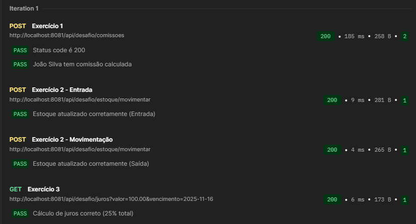

# 🎯 Desafio Backend

> Neste projeto eu desenvolvi uma API REST para solucionar os desafios de lógica de negócios propostos envolvendo cálculo de comissões, controle de estoque e cálculo de juros compostos.

## 🚀 Tecnologias

| Tecnologia | Versão |
|-----------|--------|
| **Java** | 17+ |
| **Spring Boot** | 3.x (Web) |
| **Maven** | 3.x+ |
| **Lombok** | Latest |

## 📋 Funcionalidades

### 💰 Cálculo de Comissões de Vendas

Processa uma lista de vendas e calcula a comissão total por vendedor baseada nas seguintes regras:

- Vendas abaixo de R$ 100,00: **Sem comissão**
- Vendas entre R\$ 100,00 e R$ 499,99: **1% de comissão**
- Vendas a partir de R$ 500,00: **5% de comissão**

### 📦 Controle de Estoque (In-Memory)

Gerencia a entrada e saída de produtos, validando se há estoque suficiente para saídas.

- Mantém o estado dos produtos em memória
- Gera um identificador único para cada movimentação
- Possui funcionalidade de **Reset** para facilitar testes manuais

### 📊 Cálculo de Juros

Calcula o valor atualizado de uma dívida baseada em dias de atraso.

- Taxa de multa: **2,5% ao dia** (Juros simples sobre o valor original)

---

## 🛠️ Como Rodar o Projeto

### Pré-requisitos

- Java JDK 17+ instalado
- Maven instalado

### Passo a Passo

1. Clone o repositório:

```bash
git clone https://github.com/kyso1/desafio-backend-spring.git
```

1. Entre na pasta do projeto:

```bash
cd desafio-backend-spring
```

1. Execute a aplicação via Maven:

```bash
mvn spring-boot:run
```

> A aplicação iniciará na porta 8080 (ou 8081 se configurado no `application.properties`).

---

## 🔌 Documentação da API (Endpoints)

Abaixo estão os exemplos de requisição para testar cada exercício.

### 💰 Calcular Comissões (Exercício 1)

Recebe uma lista de vendas e retorna o total de comissão por vendedor.

**Endpoint:** `POST /api/desafio/comissoes`

**Exemplo de Body (JSON):**

```json
{
  "vendas": [
    { "vendedor": "João Silva", "valor": 1200.50 },
    { "vendedor": "João Silva", "valor": 950.75 },
    { "vendedor": "Maria Souza", "valor": 90.00 }
  ]
}
```

**Exemplo de Resposta:**

```json
{
  "João Silva": 107.56,
  "Maria Souza": 0.00
}
```

---

### 📦 Movimentar Estoque (Exercício 2)

Realiza a entrada ou saída de mercadorias.

**Endpoint:** `POST /api/desafio/estoque/movimentar`

**Exemplo de Body (JSON) - Entrada:**

```json
{
  "codigoProduto": 101,
  "descricaoMovimentacao": "Entrada NF 550",
  "tipo": "ENTRADA",
  "quantidade": 50
}
```

**Exemplo de Body (JSON) - Saída:**

```json
{
  "codigoProduto": 104,
  "descricaoMovimentacao": "Venda Balcão",
  "tipo": "SAIDA",
  "quantidade": 20
}
```

**Resetar Estoque (Apenas para Testes):**

Como o banco é em memória, use este endpoint para voltar aos valores originais do exercício.

**Endpoint:** `POST /api/desafio/estoque/reset`

---

### 📅 Calcular Juros (Exercício 3)

Calcula o valor final de uma conta com base na data de vencimento.

**Endpoint:** `GET /api/desafio/juros`

**Parâmetros (Query Params):**

- `valor`: Valor original da dívida (ex: 100.00)
- `vencimento`: Data de vencimento no formato YYYY-MM-DD

**Exemplo de URL:**

```bash
http://localhost:8080/api/desafio/juros?valor=100.00&vencimento=2023-01-01
```

---

## 🧪 Testes

Os testes podem ser realizados via **Postman** ou **Insomnia** importando as URLs e JSONs descritos acima.

### 📮 Guia Completo: Testando com Postman

#### 1️⃣ Instalar e Configurar Postman

1. Baixe o Postman em: [https://www.postman.com/downloads/](https://www.postman.com/downloads/)
2. Instale e abra a aplicação
3. Crie uma nova coleção clicando em `+ New` → `Collection`

#### 2️⃣ Testando o Endpoint de Comissões

1. Clique em `+ Add request`
2. Configure:
   - **Método:** `POST`
   - **URL:** `http://localhost:8080/api/desafio/comissoes`
   - **Body:** Selecione `raw` e escolha `JSON`
   - Copie e cole:

```json
{
  "vendas": [
    { "vendedor": "João Silva", "valor": 1200.50 },
    { "vendedor": "João Silva", "valor": 950.75 },
    { "vendedor": "Maria Souza", "valor": 90.00 }
  ]
}
```

1. Clique em `Send` para executar
2. Você deve receber uma resposta similar a:

```json
{
  "João Silva": 107.56,
  "Maria Souza": 0.00
}
```

#### 3️⃣ Testando o Endpoint de Estoque

**Movimentação de Entrada:**

1. Crie uma nova request `POST`
2. Configure:
   - **URL:** `http://localhost:8080/api/desafio/estoque/movimentar`
   - **Body (raw - JSON):**

```json
{
  "codigoProduto": 101,
  "descricaoMovimentacao": "Entrada NF 550",
  "tipo": "ENTRADA",
  "quantidade": 50
}
```

1. Clique em `Send`

**Movimentação de Saída:**

1. Crie uma nova request `POST`
2. Configure:
   - **URL:** `http://localhost:8080/api/desafio/estoque/movimentar`
   - **Body (raw - JSON):**

```json
{
  "codigoProduto": 101,
  "descricaoMovimentacao": "Venda Balcão",
  "tipo": "SAIDA",
  "quantidade": 20
}
```

1. Clique em `Send`

**Resetar Estoque:**

1. Crie uma nova request `POST`
2. Configure:
   - **URL:** `http://localhost:8080/api/desafio/estoque/reset`
3. Clique em `Send`

#### 4️⃣ Testando o Endpoint de Juros

1. Crie uma nova request `GET`
2. Configure:
   - **URL:** `http://localhost:8080/api/desafio/juros?valor=100.00&vencimento=2023-01-01`
3. Clique em `Send`
4. Você receberá o valor atualizado da dívida com os juros calculados

#### 💡 Dicas Úteis

- **Salvar requisições:** Todas as requests são salvas automaticamente na coleção
- **Ambiente:** Crie um ambiente no Postman com a variável `base_url = http://localhost:8080` para facilitar
- **Teste rápido:** Use `Ctrl + Enter` para enviar requisições rapidamente
- **Histórico:** Todas as requisições aparecem no histórico (aba History)

---

### ✅ Testes de Validação Completos (Assertions)

O Postman permite criar testes automatizados para validar as respostas. Abaixo estão todas as 5 requisições com seus testes completos:

#### 🔧 Configuração Inicial do Postman

1. Abra o Postman
2. Crie uma **Coleção** chamada "Desafio Backend"
3. Crie um **Ambiente** e adicione esta variável:
   - Nome: `url`
   - Valor: `http://localhost:8080`

---

#### 1️⃣ Requisição: Calcular Comissões

**Método:** `POST`  
**URL:** `{{url}}/api/desafio/comissoes`

**Aba Body (Raw JSON):**

```json
{
    "vendas": [
        { "vendedor": "João Silva", "valor": 1200.50 },
        { "vendedor": "João Silva", "valor": 950.75 },
        { "vendedor": "João Silva", "valor": 1800.00 },
        { "vendedor": "João Silva", "valor": 1400.30 },
        { "vendedor": "João Silva", "valor": 1100.90 },
        { "vendedor": "João Silva", "valor": 1550.00 },
        { "vendedor": "João Silva", "valor": 1700.80 },
        { "vendedor": "João Silva", "valor": 250.30 },
        { "vendedor": "João Silva", "valor": 480.75 },
        { "vendedor": "João Silva", "valor": 320.40 },
        { "vendedor": "Maria Souza", "valor": 2100.40 },
        { "vendedor": "Maria Souza", "valor": 1350.60 },
        { "vendedor": "Maria Souza", "valor": 950.20 },
        { "vendedor": "Maria Souza", "valor": 1600.75 },
        { "vendedor": "Maria Souza", "valor": 1750.00 },
        { "vendedor": "Maria Souza", "valor": 1450.90 },
        { "vendedor": "Maria Souza", "valor": 400.50 },
        { "vendedor": "Maria Souza", "valor": 180.20 },
        { "vendedor": "Maria Souza", "valor": 90.75 },
        { "vendedor": "Carlos Oliveira", "valor": 800.50 },
        { "vendedor": "Carlos Oliveira", "valor": 1200.00 },
        { "vendedor": "Carlos Oliveira", "valor": 1950.30 },
        { "vendedor": "Carlos Oliveira", "valor": 1750.80 },
        { "vendedor": "Carlos Oliveira", "valor": 1300.60 },
        { "vendedor": "Carlos Oliveira", "valor": 300.40 },
        { "vendedor": "Carlos Oliveira", "valor": 500.00 },
        { "vendedor": "Carlos Oliveira", "valor": 125.75 },
        { "vendedor": "Ana Lima", "valor": 1000.00 },
        { "vendedor": "Ana Lima", "valor": 1100.50 },
        { "vendedor": "Ana Lima", "valor": 1250.75 },
        { "vendedor": "Ana Lima", "valor": 1400.20 },
        { "vendedor": "Ana Lima", "valor": 1550.90 },
        { "vendedor": "Ana Lima", "valor": 1650.00 },
        { "vendedor": "Ana Lima", "valor": 75.30 },
        { "vendedor": "Ana Lima", "valor": 420.90 },
        { "vendedor": "Ana Lima", "valor": 315.40 }
    ]
}
```

**Aba Tests:**

```javascript
// Verifica se a API respondeu com sucesso
pm.test("Status code é 200", function () {
    pm.response.to.have.status(200);
});

// Verifica se os vendedores foram processados
pm.test("Retorno contém João Silva e comissão calculada", function () {
    var jsonData = pm.response.json();
    pm.expect(jsonData).to.have.property("João Silva");
    pm.expect(jsonData["João Silva"]).to.be.above(0);
});

pm.test("Retorno contém Maria Souza", function () {
    var jsonData = pm.response.json();
    pm.expect(jsonData).to.have.property("Maria Souza");
});
```

---

#### 2️⃣ Requisição: Entrada de Estoque

**Método:** `POST`  
**URL:** `{{url}}/api/desafio/estoque/movimentar`

**Aba Body (Raw JSON):**

```json
{
    "codigoProduto": 101,
    "descricaoMovimentacao": "Entrada Teste",
    "tipo": "ENTRADA",
    "quantidade": 50
}
```

**Aba Tests:**

```javascript
pm.test("Status code é 200", function () {
    pm.response.to.have.status(200);
});

pm.test("Estoque atualizado corretamente (150 + 50 = 200)", function () {
    var jsonData = pm.response.json();
    // O produto 101 começa com 150 no JSON original
    pm.expect(jsonData.saldoFinal).to.eql(200);
});
```

---

#### 3️⃣ Requisição: Saída de Estoque

**Método:** `POST`  
**URL:** `{{url}}/api/desafio/estoque/movimentar`

**Aba Body (Raw JSON):**

```json
{
    "codigoProduto": 104,
    "descricaoMovimentacao": "Saída Teste",
    "tipo": "SAIDA",
    "quantidade": 20
}
```

**Aba Tests:**

```javascript
pm.test("Status code é 200", function () {
    pm.response.to.have.status(200);
});

pm.test("Estoque atualizado corretamente (320 - 20 = 300)", function () {
    var jsonData = pm.response.json();
    // O produto 104 começa com 320 no JSON original
    pm.expect(jsonData.saldoFinal).to.eql(300);
});
```

---

#### 4️⃣ Requisição: Calcular Juros (Automático)

**Método:** `GET`  
**URL:** `{{url}}/api/desafio/juros?valor=100.00&vencimento={{dataVencimento}}`

**Aba Pre-request Script** (IMPORTANTE - copie isso para gerar a data de 10 dias atrás automaticamente):

```javascript
// Cria uma data de 10 dias atrás
var data = new Date();
data.setDate(data.getDate() - 10);

// Formata para YYYY-MM-DD
var dataFormatada = data.toISOString().split('T')[0];

// Salva na variável global do Postman
pm.environment.set("dataVencimento", dataFormatada);
```

**Aba Tests:**

```javascript
pm.test("Cálculo de juros correto (25%)", function () {
    var resposta = pm.response.json();
    // 10 dias * 2.5% = 25% de multa.
    // 100 + 25 = 125
    pm.expect(resposta).to.eql(125.00);
});
```

---

#### 🎯 Como Executar Todos os Testes

1. Clique em sua **Collection** "Desafio Backend" (no painel esquerdo)
2. Clique em **Run** (botão azul com ▶️ no topo)
3. Selecione todas as 5 requisições que deseja testar
4. Clique em **Run [Nome da Coleção]**
5. Veja os resultados em tempo real com ✅ (passou) ou ❌ (falhou)

---

#### 📸 Resultado dos Testes

Abaixo está a screenshot com todos os testes passando:



---
